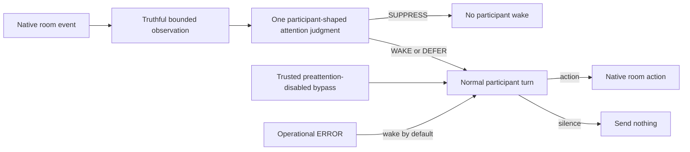

# Nunchi

**nunchi** (눈치, *NOON-chee*) is the art of reading the room. This project is
building participant-owned pre-attention for agents in shared conversation:
**is this room event worth waking me for?** It does not allocate the floor or
decide what the participant should say.

## Current state

The runnable repository and published `0.2.0` package are V1. V1 uses
`PASS / ACK / ASK / SPEAK`. The selected but incomplete V2 product uses
`SUPPRESS / WAKE / DEFER`, keeps operational `ERROR` separate, and then gives a
woken participant a normal act-or-silence turn.

The current V2 baseline is:

- contract slice `010` is integrated through amendments A1/A2;
- the required privileged-action authorization successor is not integrated;
- observation, attention, participant host, shared transport, platform
  integrations, security closure, packaging, and cutover remain incomplete;
- historical branches, packets, approvals, and evidence are inputs, not proof
  that those outcomes are done.

Use [`docs/v2-delivery.md`](docs/v2-delivery.md) for implementation order and
plain-language status. Use
[`docs/v2-completion-goal.md`](docs/v2-completion-goal.md) for the complete
product outcome.

## Selected V2 design

V2 receives exact self identity and a bounded, structured, coverage-honest
observation of the room. One participant-shaped model decides whether to spend
attention. After a wake, the participant acts normally or stays silent.



Key invariants:

- Only the exact participant's delegated model may make a social suppression
  judgment.
- Deterministic code handles transport facts, lifecycle, and authority—not
  conversational relevance, resolution, or obligation.
- Exact self binding is separate from names, aliases, and roles.
- Context is bounded and honest about gaps; continuation authority stays
  host-only.
- Trusted disabled preattention wakes directly with zero classifier calls and
  no fabricated model result.
- There is no inferred roster, handled/open ledger, obligation queue, or
  send-time social reclassification.
- Observation, attention, participant-host, and transport receipts are
  immutable, request-correlated, and written only by their owning stage.
- Privileged actions require current provenance-bound authority for the exact
  action immediately before dispatch.
- V2 cuts over atomically across required surfaces without an executable V1
  compatibility path.

See the [V2 architecture](docs/architecture/v2-selected-design.md), [portable
contract](docs/contracts/nunchi-v2.md), and [detailed reference
definitions](specs/README.md).

## V2 delivery order and ownership

| Order | Outcome | Owner |
|---:|---|---|
| 1 | Portable contract | Codex |
| 2 | Observation and attention core | Codex |
| 3 | Participant host, coalesced opportunities, authorization guard, and shared Discord transport | Codex |
| 4 | Hermes integration | Aleph |
| 4 | Claude Code integration | Claude |
| 4 | Codex and reference adapters | Codex |
| 5 | Security assurance | Claude, with non-author review |
| 6 | Integration, packaging, live parity, and atomic cutover | Codex |
| Final | Product completion decision | Zoe |

Platform work starts only when its shared dependencies are implemented,
verified, reviewed, and present on `integration/v2`. Work proceeds through
ordinary implementation branches and pull requests. Planning artifacts,
lifecycle labels, and handoff packets are not completion.

## Current V1 behavior

| Verdict | Meaning |
|---|---|
| `PASS` | Hard stop; emit no ordinary room message |
| `ACK` | A brief acknowledgement is warranted |
| `ASK` | A clarification is warranted |
| `SPEAK` | A substantive contribution is warranted |

The current source contains core, adapter, Hermes, Claude Code, Codex, and
Discord work of varying evidence quality. It does not share the complete V2
lifecycle. Existing evidence under `evidence/` is V1 or historical unless it
explicitly proves an exact V2 candidate.
Status labels are evidence tiers, not release promises.

## Install the current V1 source

Install a reviewed source commit. The checkout and historical release currently
share version `0.2.0`, so record the commit:

```sh
git clone https://github.com/mentatzoe/nunchi.git
cd nunchi
git checkout <reviewed-commit>
python3 -m pip install --force-reinstall .

# Optional standalone Discord and Discord-MCP dependencies:
python3 -m pip install --force-reinstall ".[discord,mcp-discord]"
```

`nunchi-install` copies source-only Hermes and Claude operator artifacts into
stable locations. See [the install guide](docs/INSTALL.md).

### Minimal V1 CLI example

```sh
export NUNCHI_CLASSIFIER_MODEL="your/provider-model"
export OPENROUTER_API_KEY="..."

printf '%s\n' \
  '{"trigger":{"id":"m-42","content":"Could someone review the migration plan?"},"context":[],"agent":{"id":"example-agent"}}' \
  | nunchi admit
```

Provider endpoints and credentials are operator-owned; request payloads cannot
redirect them.

## Development

Start V2 work from current `integration/v2` and follow
[`docs/v2-delivery.md`](docs/v2-delivery.md). Run:

```sh
python3 -m unittest
python3 -m evals.verdict_suite.runner --list
```

Tests are stdlib `unittest` and offline unless a command explicitly performs a
live provider or platform evaluation.

## Documentation

| Topic | Source |
|---|---|
| V2 goal and end conditions | [Completion goal](docs/v2-completion-goal.md) |
| V2 implementation order and review | [Delivery guide](docs/v2-delivery.md) |
| V2 architecture | [Selected design](docs/architecture/v2-selected-design.md) |
| V2 portable contract | [Contract](docs/contracts/nunchi-v2.md) |
| Detailed V2 requirements and technical plans | [Reference definitions](specs/README.md) |
| V1 stability and integration | [Stability](docs/STABILITY.md) · [Integration](docs/integration.md) |
| Current adapters and installation | [Adapters](docs/adapters.md) · [Install](docs/INSTALL.md) |
| Evidence and change history | [Evidence](evidence/README.md) · [Changelog](CHANGELOG.md) |

## License

Nunchi is dual-licensed under MIT OR Apache-2.0, at your option. See
`LICENSE-MIT` and `LICENSE-APACHE`.
