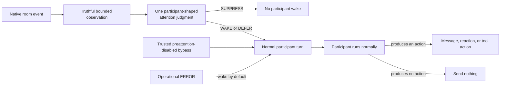
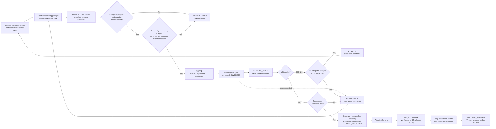

# Nunchi

**nunchi** (눈치, *NOON-chee*) is the art of reading the room. This project is
building participant-owned pre-attention for agents in shared conversation:
**is this room event worth waking me for?** It does not allocate the floor or
decide what the participant should say.

## Project state

Nunchi is between contracts. Keep these states separate:

| Surface | What exists | Contract |
|---|---|---|
| [PyPI `0.2.0`](https://pypi.org/project/nunchi/0.2.0/) | Historical release from 2026-07-02; core library plus `nunchi` and `nunchi-channel` | Older V1 `PASS / ACK / ASK / SPEAK`, including the subsequently removed deterministic fast path |
| This repository checkout | V1 runtime plus substantial unreleased adapter and harness work | Still V1; surfaces do not yet share one parity-proven lifecycle |
| Selected V2 target | Design, governance, interfaces, slices, and acceptance program are ready | `SUPPRESS / WAKE / DEFER`, with operational `ERROR` separate |
| V2 program lifecycle | 2026-07-11 reset baseline snapshot: program `READY`; implementation authority `NOT_GRANTED` | At that snapshot all slices were `PLANNED` and dormant; V1 remains current until the atomic merge is post-merge verified as `CUTOVER_VERIFIED` |

The checkout still reports package version `0.2.0`, so the version string alone
does not establish which source or integration artifacts are installed. Record
and verify the source commit for any operator deployment.

## Selected V2 design — not implemented

V2 makes Nunchi the participant's delegated pre-attention. It receives exact
self identity and a bounded, structured, coverage-honest observation of the
room. One participant-shaped model decides whether to spend a wake; after a
wake, the participant gets a normal act-or-silence turn.



The selected invariants are:

- Only a participant-shaped model may make a social suppression judgment.
- Deterministic code handles only exact duplicate delivery, retained exact-self
  no-self-wake, and unroutable or unconstructable native events—never
  conversational meaning.
- Exact self binding is separate from loose names, roles, and aliases.
- Context is bounded and structured, with honest gaps and optional expansion;
  host-only continuation authority never enters classifier input.
- Trusted disabled preattention wakes directly with zero classifier calls and
  no fabricated model disposition.
- `SUPPRESS` requires explicitly enabled, inspectable, revocable delegation and
  proven later-hearing recovery.
- Classifier-DEFER and margin-DEFER remain distinct, evidence-gated safety
  routes rather than an accidental compatibility layer.
- There is no inferred participant roster, handled/open ledger, obligation
  queue, or central floor manager.
- Observation, attention, participant-host, and transport receipts are
  immutable, request-correlated, and singly attested by their owners.
- Preattention is judged once. The participant contributes directly or stays
  silent; there is no admission meta-answer or send-time social reclassification.
- V2 cuts over atomically across every in-tree adapter and harness. There is no
  V1 compatibility bridge or mixed-contract repository state.

See the renderable [V2 architecture diagrams](docs/architecture/v2-selected-design.md)
for the component, UML, sequence, state, and execution-wave views.

## V2 implementation program

At the 2026-07-11 governance-reset baseline, the program was `READY`: its
selected design, governance, interfaces, acceptance scenes, owner lanes, and
slice plans agreed. Implementation authority was `NOT_GRANTED`, so all eleven
slices were `PLANNED` and their product tasks were dormant. This is a dated
snapshot of the shared repository program, not a permanent live registry or
participant-local execution state. Resolve live program progress from the
umbrella declaration in `specs/001-nunchi-v2-program/`, implementation
authority from `evidence/governance/v2-implementation-authorization.md`, and a
slice's state and occupant from that bound slice's declarations, immutable
activation/acceptance records, and append-only candidate/handoff attempt
streams.

| Wave | Independently owned slice | Accountable owner lane | Outcome |
|---:|---|---|---|
| 0 | `010-v2-contract` | `v2-contract-owner` | Canonical V2 request, decision, wake, continuation, and receipt contracts |
| 1 | `020-v2-observation` | `v2-observation-owner` | Truthful bounded observation and continuation |
| 1 | `030-v2-core-attention` | `v2-core-owner` | Participant-shaped pre-attention and uncertainty widening |
| 2 | `040-v2-participant-wake` | `v2-wake-owner` | Normal participant act-or-silence turn |
| 2 | `050-v2-discord-transport` | `v2-transport-owner` | Shared Discord-native continuity and transport receipts |
| 3 | `060-v2-hermes` | `v2-hermes-owner` | Hermes migration and installed-runtime evidence |
| 3 | `070-v2-claude-code` | `v2-claude-owner` | Claude Code migration and installed-runtime evidence |
| 3 | `080-v2-codex` | `v2-codex-owner` | Codex migration and installed-runtime evidence |
| 3 | `090-v2-channel-adapters` | `v2-adapters-owner` | Generic, Matrix, Telegram, and standalone Discord parity |
| 4 | `100-v2-security-provenance` | `v2-security-owner` | Blocking security, suppression-governance, and installed-provenance audit |
| 5 | `110-v2-parity-cutover` | `v2-integrator` | Sole integration sink, common live scenes, truthful docs, and atomic cutover |

An external participant delivers one existing slice at a time:



Before running either workflow, the participant uses
`python3 scripts/run_slice_workflow.py run <workflow> specs/<exact-slice>`.
The runner allowlists and preflights the existing slice, sets the exact binding
inside the workflow process, verifies exact SpecKit `0.12.11` and its pinned
PEP-610 source commit, resolves the concrete integration, verifies and pins its
manifest plus installed skill bytes with the slice input, initial task graph,
and canonical workflow digest for its run ID, and leaves
`.specify/feature.json` unchanged. Resume uses
`python3 scripts/run_slice_workflow.py resume <run-id>` and rejects changed
slice inputs, stale workflows, divergent persisted workflow copies, or a changed
integration manifest, installed skill, runtime integration, or task graph. Resume is for a paused run whose task graph
is unchanged.
If convergence adds tasks, or a completed handoff is rejected, the slice stays
or returns `ACTIVE` and its owner starts a new bound `run speckit`; a completed
run is never resumed. The external
implementation grant must be documented at
`evidence/governance/v2-implementation-authorization.md` and enumerate exactly
all eleven slices, `010` through `110`; a partial record is invalid for every
slice, and the record does not grant authority or make the slice ready.
Dependencies, one accountable owner, analysis, an isolated worktree, and
activation evidence are checked separately. Each dependent owner accepts every
required upstream handoff before its own slice becomes `READY`. At slice level,
`v2-integrator` accepts slices `010`–`100`, while Zoe accepts the exact
slice-`110` candidate.

Zoe, or an assigner durably delegated by Zoe, assigns the program owner and
each slice participant. A declaration uses `<participant identity>` —
`evidence/governance/assignments/<record>.md`; that non-symlink record contains
exactly one `Assignee`, `Lane`, `Assigned by`, ISO `Assigned on`, and durable
`Authority reference`. A non-Zoe assigner also requires `Delegated by: Zoe` and
a durable `Delegation reference`.
Assignment may precede implementation authority for planning, but does not
grant it or make a slice ready. Declarations and activation evidence carry the
assignment without creating a central assignment registry.

Only `110-v2-parity-cutover` may combine accepted handoffs. After its slice
workflow reaches `HANDOFF_READY`, Zoe's explicit `CUTOVER_ACCEPTED` decision
for the exact candidate is recorded as slice acceptance by `v2-integrator`; on
acceptance, `v2-program-owner` records only the program cutover copy. The
integrator may then perform one atomic merge, whose docs remain
`CUTOVER_ACCEPTED` with exact-main verification and final current-state wording
pending. A docs/evidence-only follow-up records exact-main verification and
final documentation validation; only then is `CUTOVER_VERIFIED` established.
Release and promotion remain separate.

The umbrella program defines all eleven owners and dependencies, nine canonical
interfaces, sixteen acceptance scenes, ordinary-path evidence requirements,
and the final integration ladder. Its ordinary-path views are the
[architecture guide](docs/architecture/v2-selected-design.md) and
[execution-spine guide](docs/governance/execution-spine.md). Files under
`specs/` are planning control plane—not product contracts or proof—and product
documentation does not depend on them.

## Current implementation: V1

Until the atomic cutover, the runnable core is a pre-reply admission gate. Its
model returns exactly one V1 verdict:

| Verdict | Current V1 meaning |
|---|---|
| `PASS` | Hard stop; emit no ordinary room message |
| `ACK` | A brief acknowledgement is warranted |
| `ASK` | A clarification is warranted |
| `SPEAK` | A substantive contribution is warranted |

Every admission in the current checkout's core is model-judged. The former
deterministic social fast path was removed after it falsely silenced direct
corrections and treated name or text equality as proof of self-causation. The
published `0.2.0` wheel predates that removal; use it only when deliberately
reproducing the historical release. The current source improvement still does
not make V1 equivalent to the selected V2 observation or lifecycle contract.

### Current V1 surfaces and evidence

| Surface | Current repository state | Committed proof | V2 slice owner(s) |
|---|---|---|---|
| Core CLI and generic channel adapter | Implemented; the older core/channel surface is released in `0.2.0` | Offline tests and the [V1 regression corpus](evidence/verdict-suite/README.md) | `010`, `030`, `040`, `090` |
| Matrix, Telegram, standalone Discord | Implemented in source | Offline tests; no committed live-server evidence | `090` |
| Shared Discord-MCP transport | Implemented in source | [Bounded transport live smoke](evidence/mcp-discord/2026-07-07-live-smoke.md) | `050` |
| Hermes plugin | Implemented in source | Offline tests; no committed integration evidence | `060` |
| Claude Code wake hook | Implemented in source | Offline tests; no committed integration evidence | `070` |
| Codex runner, hooks, and config app | Implemented in source | [Bounded V1 live smokes](evidence/codex/2026-07-09-vigil-persistent-session.md) | `080` |

Status labels are evidence tiers, not release promises. In particular, the
Codex evidence proves a bounded V1 lifecycle that still includes an outbound
social re-gate; the relevant V2 slices must replace that behavior rather than treat it as V2
parity. All current behavior records under `evidence/` remain V1 or historical
inputs until new V2 evidence is produced.

## Install and use the current V1 surface

For the current repository behavior, install a reviewed source commit. A forced
install matters because the source checkout and historical release currently
share the `0.2.0` package version:

```sh
git clone https://github.com/mentatzoe/nunchi.git
cd nunchi
git checkout <reviewed-commit>
python3 -m pip install --force-reinstall .

# Optional dependencies for the standalone Discord adapter and Discord-MCP:
python3 -m pip install --force-reinstall ".[discord,mcp-discord]"
```

The default package remains stdlib-only; the extras add their named optional
dependencies. `nunchi-install` copies Hermes and Claude operator artifacts from
a checkout into stable locations—it is not present in the published `0.2.0`
wheel. See the [operator-artifact install guide](docs/INSTALL.md).

For historical reproduction only, `python3 -m pip install "nunchi==0.2.0"`
installs the older published core and `nunchi-channel` surface. Updating this
README does not change the long description or code embedded in that release.

### Minimal V1 CLI example

Configure an OpenAI-compatible classifier and submit one admission request:

```sh
export NUNCHI_CLASSIFIER_MODEL="your/provider-model"
export OPENROUTER_API_KEY="..."

printf '%s\n' \
  '{"trigger":{"id":"m-42","content":"Could someone review the migration plan?"},"context":[],"agent":{"id":"example-agent"}}' \
  | nunchi admit
```

The command makes a real provider call and prints one V1 result object. The
provider endpoint and credentials are operator-owned; request payloads cannot
redirect them. For the in-process API, generic subprocess adapter, room
profiles, and current V1 result schema, use the explicitly versioned guides
below.

## Documentation map

| Topic | Source |
|---|---|
| Selected V2 flow, interfaces, owners, and diagrams | [V2 selected design](docs/architecture/v2-selected-design.md) |
| V2 execution model, SpecKit, workflows, and reinitialization | [V2 execution spine](docs/governance/execution-spine.md) |
| Current V1 public contract and versioning | [V1 stability contract](docs/STABILITY.md) |
| Current V1 host integration | [V1 integration guide](docs/integration.md) |
| Current V1 platform adapters | [V1 adapter reference](docs/adapters.md) |
| Source-only Hermes and Claude artifact installation | [Operator-artifact install guide](docs/INSTALL.md) |
| Current V1 evaluation corpus | [Verdict-suite guide](docs/evaluations/verdict-suite.md) |
| Implemented and historical evidence index | [Evidence index](evidence/README.md) |
| Unreleased source changes and release history | [Changelog](CHANGELOG.md) |

## Development and governance

Authority flows from the Zoe-selected Aleph Vault design—PR 67 at `bdd1ebb`,
clarified by PR 68 at `c834e8c`—to the constitution, runtime agent guidance,
the umbrella program and owned slice, then ordinary-path implementation and
proof for current behavior.

SpecKit is pinned to exactly `0.12.11`. Its managed paths are disposable
control plane and may never own product source, schemas, tests, evaluation
assets, evidence, runtime artifacts, or product documentation. Both workflows
operate on one existing slice through the bound runner described above. Neither
creates or replaces a feature, and the runner does not mutate
`.specify/feature.json`. The planning workflow stops after analysis. The
delivery workflow has separate
implementation-authority and slice-readiness gates before implementation, plus
a post-convergence documentation-freshness gate. Every
implementation must review `README.md` and affected ordinary docs, then either
update and validate them, record an evidence-backed `NO_IMPACT`, or hand an
exact shared-doc delta to its accepting owner. Known affected files must be
named individually; a directory wildcard does not satisfy the gate. Product
tasks remain dormant until the external implementation grant is recorded at
`evidence/governance/v2-implementation-authorization.md`, enumerates exactly
all eleven slices, and the bound slice independently becomes `READY`.

```sh
specify workflow info nunchi-plan
specify workflow info speckit

python3 scripts/run_slice_workflow.py run nunchi-plan \
  specs/030-v2-core-attention
# Or, after program authorization and slice readiness:
python3 scripts/run_slice_workflow.py run speckit \
  specs/030-v2-core-attention
# Resume only a paused run whose task graph is unchanged:
python3 scripts/run_slice_workflow.py resume <run-id>

python3 scripts/check_governance.py --check-cli
python3 -m unittest
python3 -m evals.verdict_suite.runner --list
```

Offline tests use stdlib `unittest`. Live provider evaluations are explicit,
cost-bearing evidence runs and are not part of the deterministic default suite.

## License

Nunchi is dual-licensed under MIT OR Apache-2.0, at your option. See
`LICENSE-MIT` and `LICENSE-APACHE`.
