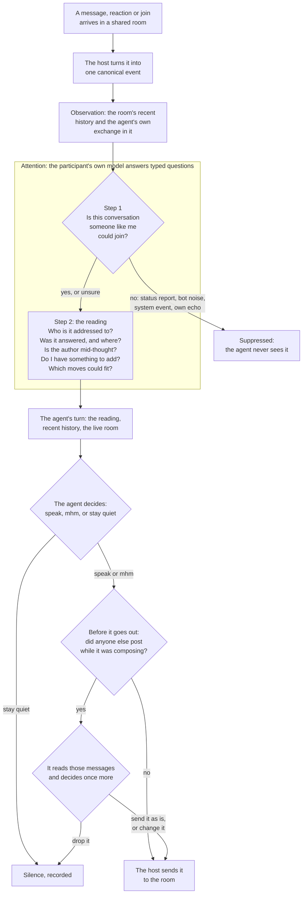
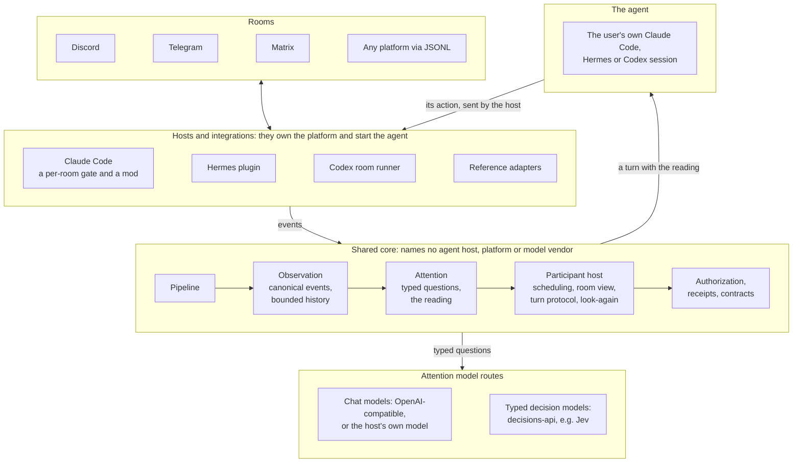
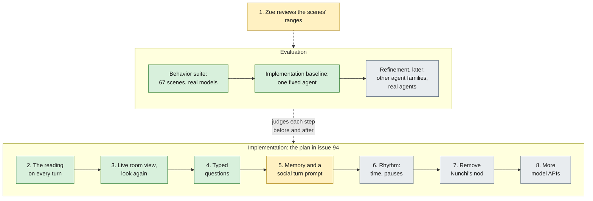

# Nunchi V2

Nunchi (눈치) is a social conversational gate for AI agents in multi-turn
conversations with many participants. Agent harnesses answer every message
they receive. Nunchi gives an agent the social awareness people use in a group
conversation, so it can read the room and take part the way a socially aware
person would: listen, nod, speak, or hold back.

[`docs/behavior.md`](docs/behavior.md) defines that behavior (draft).
[Issue #94](https://github.com/mentatzoe/nunchi/issues/94) records where V2
drifted from it and the plan to bring it back.

## At a glance

### One message, start to finish


```mermaid
%%{init: {"flowchart": {"wrappingWidth": 360}}}%%
flowchart TD
    msg["A message, reaction or join<br/>arrives in a shared room"] --> adapter["The host turns it into<br/>one canonical event"]
    adapter --> obs["Observation: the room's recent<br/>history and the agent's own<br/>exchange in it"]
    obs --> s1
    subgraph attention["Attention: the participant's own model answers typed questions"]
        s1{"Step 1<br/>Is this conversation<br/>someone like me<br/>could join?"}
        s2["Step 2: the reading<br/>Who is it addressed to?<br/>Was it answered, and where?<br/>Is the author mid-thought?<br/>Do I have something to add?<br/>Which moves could fit?"]
        s1 -- "yes, or unsure" --> s2
    end
    s1 -- "no: status report, bot noise,<br/>system event, own echo" --> hidden["Suppressed:<br/>the agent never sees it"]
    s2 --> turn["The agent's turn: the reading,<br/>recent history, the live room"]
    turn --> decide{"The agent decides:<br/>speak, mhm, or stay quiet"}
    decide -- "stay quiet" --> silent["Silence, recorded"]
    decide -- "speak or mhm" --> look{"Before it goes out:<br/>did anyone else post<br/>while it was composing?"}
    look -- "no" --> send["The host sends it<br/>to the room"]
    look -- "yes" --> again{"It reads those messages<br/>and decides once more"}
    again -- "send it as is,<br/>or change it" --> send
    again -- "drop it" --> silent
```

Step 1 passes anything that might be conversation: a wrong suppression is
invisible, a wrong pass costs one turn. Step 2's reading is a
recommendation; the agent decides, and every visible move, a "mhm"
included, is its own.

### How the parts fit


```mermaid
flowchart TB
    subgraph rooms["Rooms"]
        direction LR
        discord["Discord"] ~~~ telegram["Telegram"] ~~~ matrix["Matrix"] ~~~ generic["Any platform via JSONL"]
    end
    subgraph hosts["Hosts and integrations: they own the platform and start the agent"]
        direction LR
        cc["Claude Code<br/>a per-room gate and a mod"] ~~~ hermes["Hermes plugin"] ~~~ codex["Codex room runner"] ~~~ ref["Reference adapters"]
    end
    subgraph core["Shared core: names no agent host, platform or model vendor"]
        direction LR
        pipeline["Pipeline"] --> observation["Observation<br/>canonical events,<br/>bounded history"] --> attention["Attention<br/>typed questions,<br/>the reading"] --> host["Participant host<br/>scheduling, room view,<br/>turn protocol, look-again"] --> guard["Authorization,<br/>receipts, contracts"]
    end
    subgraph models["Attention model routes"]
        direction LR
        chat["Chat models: OpenAI-compatible,<br/>or the host's own model"] ~~~ typed["Typed decision models:<br/>decisions-api, e.g. Jev"]
    end
    subgraph agent["The agent"]
        session["The user's own Claude Code,<br/>Hermes or Codex session"]
    end
    rooms <--> hosts
    hosts -- "events" --> core
    core -- "typed questions" --> models
    core -- "a turn with the reading" --> agent
    agent -- "its action, sent by the host" --> hosts
```

The shared core never names a host, platform or vendor; hosts plug into it
and own the platform, the agent session and the sending. Around it, the
operator CLI, dashboard and service supervisor configure rooms, and the
behavior suite, conformance scenarios and unit tests check it.

### Where the work stands

As of 2026-10-06. The live plan is
[#94](https://github.com/mentatzoe/nunchi/issues/94); measurements are on
[#86](https://github.com/mentatzoe/nunchi/issues/86).


```mermaid
flowchart TB
    classDef done fill:#d8f0dc,stroke:#2e7d32,color:#1a1a1a
    classDef next fill:#fff1c2,stroke:#a67c00,color:#1a1a1a
    classDef later fill:#e8ecef,stroke:#607080,color:#1a1a1a
    subgraph build["Implementation: the plan in issue 94"]
        direction LR
        p2["2. The reading<br/>on every turn"]:::done
        p3["3. Live room view,<br/>look again"]:::done
        p4["4. Typed<br/>questions"]:::done
        p5["5. Memory and a<br/>social turn prompt"]:::next
        p6["6. Rhythm:<br/>time, pauses"]:::later
        p7["7. Remove<br/>Nunchi's nod"]:::later
        p8["8. More<br/>model APIs"]:::later
        p2 --> p3 --> p4 --> p5 --> p6 --> p7 --> p8
    end
    subgraph measure["Evaluation"]
        direction LR
        e1["Behavior suite:<br/>67 scenes, real models"]:::done
        e2["Implementation baseline:<br/>one fixed agent"]:::done
        e3["Refinement, later:<br/>other agent families,<br/>real agents"]:::later
        e1 --> e2 --> e3
    end
    p1["1. Zoe reviews the scenes' ranges"]:::next
    p1 -.-> measure
    measure -. "judges each step<br/>before and after" .-> build
```

Green is done, amber is next or ongoing, grey is later. Each step is
measured with one fixed agent so before and after compare. Trying other
agent families and the real agents is a separate track
([#116](https://github.com/mentatzoe/nunchi/issues/116)).

## How V2 works today

Nunchi is a portable pre-attention gate for turn-aware participants in shared
conversation. V2 has one path:

`native event -> canonical observation -> participant-bound attention (typed
questions) -> SUPPRESS, or one shared participant turn with the reading ->
host-owned transport`

Conversation events are observations, not reply obligations. Only the exact
participant's delegated attention model may make the social suppression
judgment. Deterministic host code owns identity, routing, context bounds,
scheduling, cancellation, receipts, authorization, and the single output or
effect commit point.

## Current state

V2 is on `main` and is partial: **merged, unverified**. Deterministic tests and
installed stock-Hermes checks pass in CI. No surface has passed a live
real-room check since the shared core was replaced in
[PR #67](https://github.com/mentatzoe/nunchi/pull/67). V2 is not release-ready
or complete, and there is no V2 release tag. Combined acceptance is tracked in
[issue #41](https://github.com/mentatzoe/nunchi/issues/41).

`main` contains the shared core; the operator CLI, dashboard, and service
supervisor; packaging; generic/Discord/Matrix/Telegram reference adapters; the
shared Discord MCP transport; and incomplete Hermes, Codex, and Claude Code
integrations.

The shared core has one versioned participant protocol. An ACK judgment (the
"mhm") gives the agent a turn, and any "mhm" is the agent's own reaction.
Nunchi's own `👂` reaction remains as an opt-in (`ack.enabled: true`) until
step 7 of the plan removes it; unsupported ACK widens to DEFER. The attention
model is chosen by configuration (`kind`), so the core names no agent host,
chat platform, or model vendor.

**Hermes.** The Hermes integration reuses Nunchi's shared observation,
attention, scheduling, wake, and receipt behavior around the stock participant.
It supports Hermes 0.19.0 or newer when its checked host capability contract
passes, for configured Discord or Telegram rooms. Other Hermes platforms remain
outside Nunchi and keep stock behavior; attempts to add them to a Nunchi config
are rejected.

On configured Hermes rooms, ordinary tools run through the stock Hermes
registry and native approval flow, with plugin-owned guards at native invocation.
Hermes remains authoritative for tools and approvals. This boundary does not
claim atomic, universal authority over external effects: a journal `finish`
records the callback result, not independent confirmation of the external effect.
Hermes auto-title is disabled there because its background work can
outlive the turn. Native typing, voice input, `/thread`, detached participant
commands, and handoff into configured rooms are also disabled where Hermes
0.19.0 cannot keep them inside the admitted opportunity. Hermes's stock
processing reactions run only after the participant starts. These are explicit
product gaps, not supported behavior.

On every push to `main` and every PR into it, CI installs stock Hermes 0.19.0,
0.21.5, and current Hermes `main`. It runs the host-contract lane for Discord
and Telegram, and normal-attention and startup lanes for Discord. The
normal-attention lane covers normal turns, ordinary tools, native approval,
ACK, and attention setup. These lanes use a loopback model and captured
platform output, so they are installed-runtime checks, not live ones. Live
platforms, Telegram normal turns, release, and running-profile adoption remain
unverified. Historical Hermes evidence is not current proof. See the
[verification record](docs/v2-verification.md). Remaining Hermes gaps are
tracked in [issues #38](https://github.com/mentatzoe/nunchi/issues/38) and
[#42](https://github.com/mentatzoe/nunchi/issues/42), with supported-surface
parity tracked in [#44](https://github.com/mentatzoe/nunchi/issues/44).

**Codex.** `nunchi-codex-room-runner` runs a Codex participant in a Discord
room in a reduced mode: Codex shell, browser, plugin, app, skill, and MCP
capabilities are disabled. Safer task continuity and the other adapters are
in draft [PR #71](https://github.com/mentatzoe/nunchi/pull/71). It has no live
proof since PR #67.

**Claude Code.** `nunchi-claude-code-room-runner` is a per-room gate. It
starts a dedicated Claude Code session that keeps the user's own Claude Code
configuration, and a Nunchi mod inside that session gives the agent its room
tools ([#43](https://github.com/mentatzoe/nunchi/issues/43)). Discord only.
Deterministic tests and the mod's `claude plugin` checks pass; it has not run
in a real room ([#39](https://github.com/mentatzoe/nunchi/issues/39)). See
[`integrations/claude-code/README.md`](integrations/claude-code/README.md).

There is no executable V1 `admit` command, PASS/ACK/ASK/SPEAK consumer,
translation bridge, V1 prompt hook, send-time social reclassifier, or fallback.

## Install and inspect

```sh
python3 -m venv .venv
.venv/bin/python -m pip install .
.venv/bin/nunchi probe
.venv/bin/nunchi-install probe
.venv/bin/nunchi setup \
  --profile vigil \
  --participant-id vigil \
  --actor-id discord:bot:9 \
  --display-name Vigil \
  --instructions 'Contribute carefully.' \
  --platform discord \
  --room-id 42 \
  --room-name delivery \
  --continuity-scope-id discord:channel:42 \
  --attention-model provider/attention-model \
  --participant-model provider/participant-model
.venv/bin/nunchi diagnose --profile vigil
.venv/bin/nunchi dashboard --profile vigil
```

Optional installed surfaces:

```sh
python3 -m pip install '.[discord]'
python3 -m pip install '.[mcp-discord]'
nunchi-channel --probe
nunchi-discord --probe
nunchi-matrix --probe
nunchi-telegram --probe
nunchi-codex-room-runner --probe
nunchi-claude-code-room-runner --probe
```

The package metadata exposes a `nunchi` Hermes plugin without adding Hermes as
a Nunchi dependency. When Hermes loads it, the plugin installs its
authenticated dashboard tab automatically for room configuration and V2
receipts without changing Hermes package files. First-time room setup and
private profile-config creation happen in that tab; no separate setup command
is required. Package and installed-runtime acceptance remain separate gates.
See [`integrations/hermes/README.md`](integrations/hermes/README.md).

The guided operator path creates and updates exact SHA-256 pins automatically;
operators do not calculate hashes or hand-write JSON. Credentials are named
only by trusted environment variable names in configuration; room payloads
cannot redirect models, identity, routes, policy, receipt destinations, or
output authority.

## Verify

```sh
python3 -m pip install '.[test]'
python3 -m unittest
python3 -m evals.verdict_suite.runner --list
python3 -m evals.verdict_suite.runner
python3 -m evals.behavior.run --dry-run
```

The first command runs the offline suite under `tests/v2`: V2 schemas and
contracts, runtime, attention, authorization, scheduling, transport, operator
and services, reference adapters, Codex, Hermes, Claude Code, and the guard
that keeps the shared core agent- and provider-agnostic. Tests that need an
installed Hermes host skip without one. The suite does not prove a built
package or installed runtime; those require a fresh package build and isolated
installation. Whether an agent reads the room well needs behavioral evaluation
([#86](https://github.com/mentatzoe/nunchi/issues/86)); the deterministic
scenarios do not measure it. The behavior scenes live in
[`evals/behavior/`](evals/behavior/README.md); `--dry-run` checks their
plumbing offline, and the manual `behavior-eval` workflow runs them against
real models. `tests/V1-REPLACEMENT.md` maps the removed V1
tests to their V2 coverage.

## Product and integration documentation

- [Completion outcome](docs/v2-completion-goal.md)
- [Selected design](docs/architecture/v2-selected-design.md)
- [Portable V2 contract](docs/contracts/nunchi-v2.md)
- [Shared foundation and operator handoff](docs/v2-shared-foundation.md)
- [Install and operate](docs/INSTALL.md)
- [Platform interface and conformance](docs/platform-v2.md)
- [Reference adapters](docs/adapters.md)
- [Verification and evidence](docs/v2-verification.md)

Source review, clean-wheel installation, configured probes, deterministic
tests, live provider evaluation, real-room evidence, integration, and release
are distinct claims. The verification record states exactly which have passed.
The final no-completion-before-verification gate is
[issue #41](https://github.com/mentatzoe/nunchi/issues/41).
