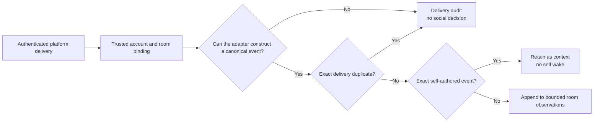
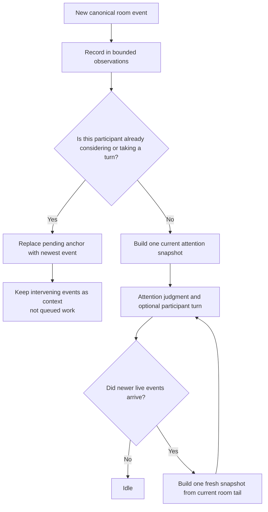
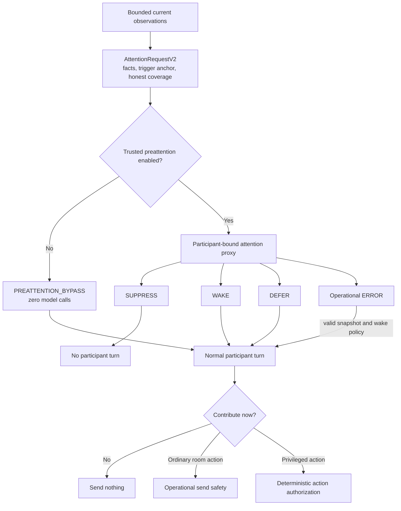
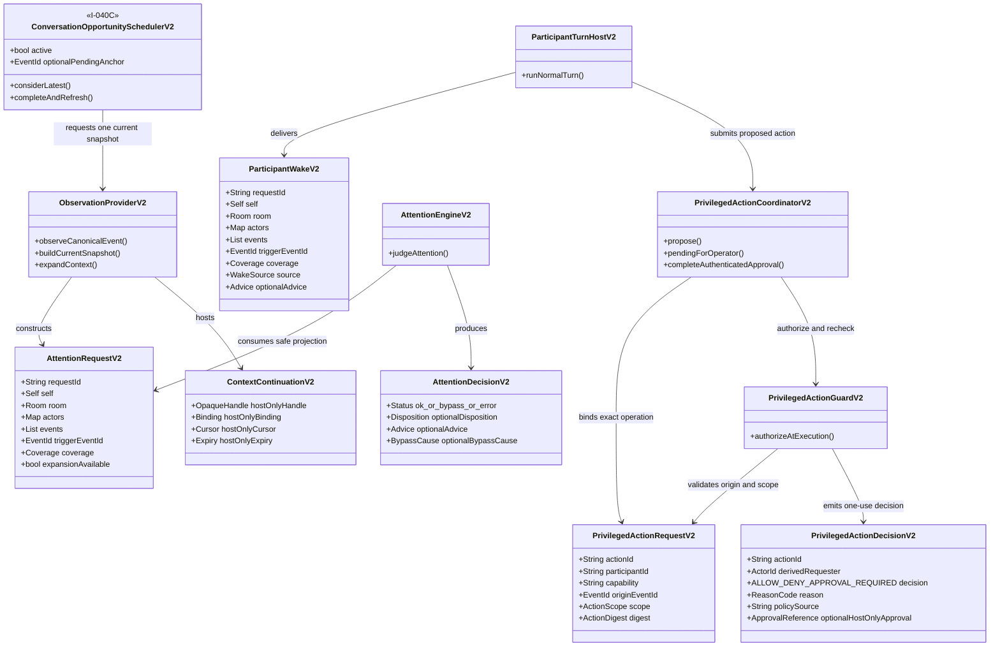
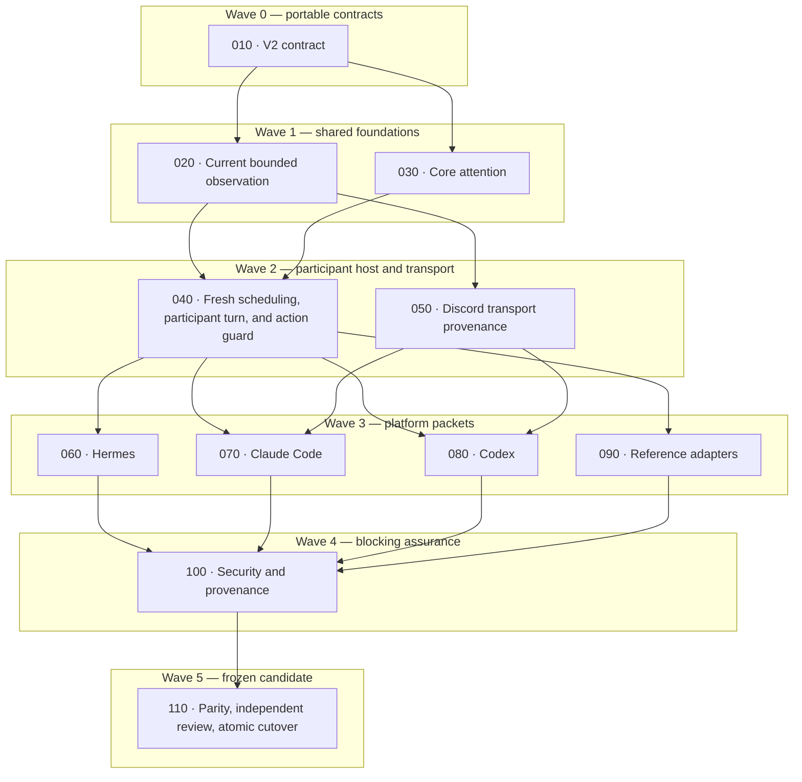

# Nunchi V2 selected product design

> **Status:** this document describes the selected V2 target from Aleph Vault
> PR 67 (`bdd1ebb`), as clarified by PR 68 (`c834e8c`) and the 2026-07-20
> implementation clarification on live-conversation freshness and privileged
> action authorization. Program implementation authority is granted, but the
> repository's `main` branch still implements V1. V2 becomes current only after
> the atomic successor is accepted, merged, and verified as
> `CUTOVER_VERIFIED`.

This is the readable architecture reference. Machine-readable contracts belong
under `schemas/v2/`; implementation and evidence must agree with those
contracts before this document can describe current behavior.

## Product boundary

Nunchi is a participant's delegated pre-attention for a shared conversation.
It answers whether the current conversation is worth waking that participant
for. It does not allocate the floor, compose a reply, maintain a queue of
unanswered messages, or authorize a privileged tool action.

Three decisions remain deliberately separate:

1. **Can this delivery be trusted as an observation?** Deterministic transport
   and adapter code establishes provenance, exact identity, room binding, and
   duplicate status.
2. **Is the current conversation worth this participant's attention?** A
   participant-bound attention proxy makes the only social judgment and returns
   `SUPPRESS`, `WAKE`, or `DEFER`.
3. **May this privileged action be executed for this requester?** A
   deterministic host guard binds the action to an authenticated origin event
   and checks a narrowly scoped capability immediately before execution.

Social judgment cannot grant authority. Authorization cannot decide whether a
message is socially relevant.

## From platform delivery to observation

A platform adapter receives an authenticated raw delivery and produces either
a canonical event or a transport audit record. The four terms below have no
social meaning:

- **Authorized delivery:** it arrived through the configured account,
  connection, and room boundary.
- **Constructible event:** the adapter can identify the room, event kind,
  stable event ID, and exact actor IDs required by that event kind.
- **Routable event:** trusted installation configuration maps the room to this
  participant; room text cannot create or redirect this mapping.
- **Novel event:** the delivery ID is not an exact retained duplicate. Novel
  does not mean unanswered, unresolved, or worthy of a reply.

Exact self binding compares the canonical event author or cause with the
transport-attested `self.actor_id`. Names, aliases, roles, mentions, quoted
text, and display names never establish authorship or authorization.



Unsupported payloads, duplicates, and events outside the trusted route are
delivery outcomes keyed by platform delivery ID. They do not receive fabricated
attention request IDs or model `SUPPRESS` results.

Once a canonical event exists, failure to assemble a valid attention snapshot
is an operational fault. The host makes one bounded reconstruction attempt from
its current observation/native-history seam. A recovered valid snapshot follows
the normal `ERROR_FALLBACK` policy. If no valid snapshot can be constructed, the
host reports the failure conspicuously and emits no fabricated participant
action. That is an adapter failure, not social suppression.

## Live conversation, not a FIFO work queue

Every accepted event is recorded as an observation. It is never converted into
an obligation to answer. Scheduling is per participant and room, with at most:

- one active attention or participant turn; and
- one replaceable pointer to the newest event that arrived while that turn was
  active.

All intervening events remain in the bounded observation buffer. They do not
become separate jobs.



The trigger is an anchor explaining why consideration began. It is not the
message the participant must answer, a claim that the floor remains open, or a
status marker. The attention proxy judges the assembled conversation as it
currently stands. A woken participant receives the freshest bounded factual
room view available at invocation and is instructed to contribute naturally or
remain silent if the moment has passed.

Freshness is not decided by a deterministic age cutoff. An older direct mention
must not disappear merely because newer chatter arrived, and code must not
declare a topic resolved from reply topology or wording. Coalescing prevents
mechanical catch-up; the stochastic attention and participant judgments handle
conversational meaning.

On restart, the pending pointer is discarded. Restored or backfilled history is
context only and never becomes a backlog of wake jobs. A new live event may use
that history in its snapshot. Attention outcomes and receipts are never replayed
as evidence that earlier messages remain open.

### Per-room scheduler states

```mermaid
stateDiagram-v2
    [*] --> Idle
    Idle --> Active: first eligible live event
    Active --> ActiveWithPending: newer event arrives
    ActiveWithPending --> ActiveWithPending: replace pending anchor
    Active --> Idle: active work completes, no newer event
    ActiveWithPending --> Active: active work completes; immediately assemble one fresh snapshot
    Active --> Idle: host cancellation; discard wake work
    ActiveWithPending --> Idle: host cancellation; discard pending wake work
    Active --> Idle: restart; observations may be restored as context
    ActiveWithPending --> Idle: restart; discard pending anchor
```



There is no handled/open state, response debt, speaker allocation, or per-event
participant job. A continuously active room may create successive fresh
considerations, but Nunchi never catches up message by message.
Cancellation drops both the exact active generation and any pending anchor;
already retained events remain factual context for a later live opportunity
but are not promoted into orphaned or replayed wake work.

## Attention and contribution



Only the participant-bound proxy can make the social `SUPPRESS` judgment.
Uncertainty widens attention through `WAKE` or `DEFER`. Trusted preattention
bypass is a host policy branch and never fabricates a classifier result.

The participant produces its real room action or silence in the same normal
turn. There is no admission meta-answer and no send-time social
reclassification. Operational send limits remain allowed because they enforce
mechanical safety without interpreting the conversation.

## Canonical data and service boundaries



The classifier sees factual coverage and whether expansion is available. It
never receives continuation handles, bindings, cursors, expiry values, policy
secrets, capability tokens, or credentials.

The participant host owns `I-040C` because it observes when attention and
participant turns start and finish. The observation provider supplies the
bounded current room view and high-water facts but does not infer turn state.
The scheduler's pending anchor is ephemeral operational state. It is not part
of the public attention request, conversation memory, or receipts.

## Privileged action authorization

Open multi-user rooms are adversarial input surfaces. A message can propose an
action, but message text cannot authorize one. The participant may infer what
capability an instruction is asking for; the host decides whether execution is
permitted.

For each privileged action, the participant host submits:

- a unique action ID and digest of the exact proposed operation;
- a namespaced capability such as `nunchi.policy.update` or
  `workspace.file.write`;
- the exact origin event ID on whose behalf the action is proposed; and
- the requested platform, room, participant, and resource scope.

The guard then:

1. resolves the origin event from trusted observations;
2. derives the requester from that event's transport-attested actor ID;
3. reloads the trusted capability policy and checks revocation, expiry, scope,
   resource constraints, and approval requirements;
4. returns `ALLOW`, `DENY`, or `APPROVAL_REQUIRED`; and
5. binds an `ALLOW` to that single action ID and digest so it cannot authorize a
   later or modified operation.

The safe default for a privileged mutation, destructive operation, external
side effect, secret-bearing operation, or account/configuration change is
`APPROVAL_REQUIRED`. Direct `ALLOW` is available only when trusted operator
policy explicitly preauthorizes that exact actor capability and scope. This is
an operator decision, not a conclusion inferred from the wording of a message.

`APPROVAL_REQUIRED` creates a host-only challenge bound to the exact action ID,
digest, requester, capability, scope, approver set, and expiry. Approval must
arrive through a trusted authenticated interaction or local operator channel
that identifies the approver exactly. An ordinary follow-up message saying
“approved,” a reaction, quoted approval, model assertion, or copied challenge
cannot satisfy it. After approval, the guard rechecks policy, revocation,
expiry, scope, and the action digest before executing once.

The host coordinator retains the exact request, observation, operation and
executor only in bounded, expiring process memory. It exposes an inspectable
copy to the trusted operator surface, never to the room participant. Restart
discards every pending approval: a proposal is not a durable conversational
obligation and is never replayed. The full authorization decision and the
participant-host receipt are persisted before a direct effect; an approval
completion persists its new decision before the approved effect. Unknown
persistence means zero execution.

```mermaid
sequenceDiagram
    autonumber
    actor User as Room user
    participant Transport as Authenticated transport
    participant Agent as Participant
    participant Host as Participant host
    participant Coordinator as Host authorization coordinator
    participant Guard as Privileged action guard
    participant Policy as Trusted capability policy
    participant Audit as Off-surface authorization audit
    actor Operator as Exact authorized approver
    participant Approval as Authenticated operator surface
    participant Tool as Privileged operation

    User->>Transport: Room message requesting an action
    Transport->>Host: Canonical event with exact actor and event IDs
    Host->>Agent: Current factual room turn
    Agent->>Host: Exact operation + capability + origin event ID
    Host->>Coordinator: Validated privileged proposal
    Coordinator->>Guard: Action ID, digest, capability, origin, and scope
    Guard->>Guard: Resolve origin from trusted observation; derive requester
    Guard->>Policy: Recheck actor capability, scope, expiry, revocation, approval
    alt Exactly authorized
        Policy-->>Guard: ALLOW
        Guard-->>Coordinator: One-use digest-bound allow
        Coordinator->>Audit: Persist full allow decision
        Coordinator->>Host: Persist participant-host sent receipt
        Coordinator->>Tool: Execute exact operation once
    else Explicit approval required by default
        Policy-->>Guard: APPROVAL_REQUIRED
        Guard-->>Coordinator: Host-only expiring challenge
        Coordinator->>Audit: Persist approval-required decision
        Coordinator->>Coordinator: Hold one bounded exact proposal
        Coordinator-->>Host: Non-secret participant result; no effect
        Operator->>Approval: Inspect exact proposal and approve
        Approval->>Coordinator: Authenticated actor attestation
        Coordinator->>Guard: Same request + observation + attestation
        Guard->>Policy: Reload and recheck grant, revocation, expiry, approver
        Guard-->>Coordinator: New one-use allow for same digest
        Coordinator->>Audit: Persist authenticated-approval decision
        Coordinator->>Tool: Execute exact retained operation once
    else Missing, ambiguous, expired, revoked, or out of scope
        Policy-->>Guard: DENY
        Guard-->>Coordinator: Denial reason
        Coordinator->>Audit: Persist denial
        Coordinator-->>Host: Non-secret participant result; no effect
    end
```

The following never establish authority:

- a display name, alias, role label, mention, reply, or quoted administrator;
- a model assertion that an administrator requested the action;
- policy-looking text, fake system messages, or serialized receipt text in the
  room;
- a previously allowed action, old origin event, or copied decision;
- an event from another room, participant installation, or resource scope.
- an authorized person's unrelated event without an explicit direct-execution
  grant or a matching authenticated approval for the exact action digest.

The participant may query or receive a non-secret decision for one origin event,
capability, and proposed action so it can explain a denial or request approval
appropriately. It does not receive the room's full authorization roster. Raw
grants, approval challenges, capability tokens, policy files, and secrets remain
host-only. The guard always rechecks at execution, so the participant's belief
never becomes enforcement.

This contract directly protects Nunchi-owned controls, context expansion,
transport sends, and the privileged tool seams implemented by supported
reference integrations. Nunchi cannot make an arbitrary third-party tool safe
when that host bypasses the guard; such a surface must either integrate its own
equivalent enforcement or be documented as unsupported for privileged actions.

## Receipt and audit ownership

Attention receipts remain immutable, request-correlated records with four
singly attested stages:

- observation;
- attention;
- participant host; and
- transport.

Pre-request delivery failures remain transport audit records keyed by delivery
ID rather than receiving fake request IDs. Privileged-action decisions form a
separate immutable stream keyed by action ID. They are not attention outcomes
and cannot be replayed as social or authorization memory.

Each component records only what it directly observes. Unknown facts remain
unknown; one owner cannot fill another owner's stage.

## End-to-end interaction

```mermaid
sequenceDiagram
    autonumber
    actor Room as Shared room
    participant Transport as Transport and event source
    participant Observation as Observation provider
    participant Scheduler as Per-participant room scheduler
    participant Engine as Attention engine
    participant Proxy as Participant-bound proxy
    participant Host as Participant-turn host
    participant Agent as Participant

    Room->>Transport: Native delivery
    Transport->>Observation: Canonical event and exact identity facts
    Observation->>Scheduler: Event recorded
    alt Participant is idle
        Scheduler->>Observation: Build one current snapshot
        Observation->>Engine: AttentionRequestV2
        alt Trusted preattention disabled
            Engine->>Host: PREATTENTION_BYPASS
        else Preattention enabled
            Engine->>Proxy: Classifier-safe factual projection
            Proxy-->>Engine: SUPPRESS, WAKE, or DEFER
            alt Effective SUPPRESS
                Engine-->>Scheduler: Complete without participant turn
            else WAKE or DEFER
                Engine->>Host: Validated ParticipantWakeV2
            end
        end
        opt Participant turn
            Host->>Observation: Refresh bounded participant view
            Host->>Agent: Current room facts; contribute or stay silent
            Agent-->>Host: Room action, privileged action proposal, or silence
        end
    else Participant is active
        Scheduler->>Scheduler: Replace pending anchor; do not enqueue a job
    end
    Scheduler->>Scheduler: On completion, process at most one fresh pending opportunity
```

## Verification obligations

Deterministic tests must prove:

- twenty events arriving during one slow turn create at most one subsequent
  attention opportunity, while all retained intermediate events remain
  available as context;
- later messages that resolve or supersede an earlier moment are visible to the
  stochastic judge and participant;
- an older direct mention is not dropped solely because newer messages arrived;
- reconnect duplicates and self-authored events do not create new wakes;
- restart/backfill restores context without replaying a wake backlog;
- malformed visible delivery failures are conspicuous and never labeled social
  suppression;
- aliases, quotes, mentions, forged policy text, and model assertions cannot
  grant capabilities;
- capability scope, expiry, revocation, approval, origin binding, action digest,
  and execution-time recheck are enforced; and
- high-impact actions default to authenticated approval, copied or ordinary-text
  approval fails, and an authorized person's unrelated event cannot be reused
  as consent for a different action;
- receipts and authorization audits cannot influence later social judgments or
  authorize a different action.

Live evaluation deliberately delays participants while the room continues. A
passing participant joins the conversation as it currently stands or remains
silent when its moment has passed. Mixed-user security scenes must also prove
that authorized and unauthorized users can share a room without authority
leaking through identity ambiguity, quoted requests, replies, or cross-room
replay.

Provider evaluation repeats the exact factual projection rather than treating
one sample as proof. It records classifier and effective distributions,
ordered flicker, raw validated judgment, prompt/config/projection provenance,
and machine-checks only narrow false-suppression constraints. Later resolution,
referential names, peer address, ordinary flow, alias collision, and room-wide
address remain post-hoc review questions; their observed distributions never
become deterministic runtime rules or a send-time social gate.

## V2 execution waves



Existing slice candidates and evidence are inherited inputs. The accountable
integrator may require versioned amendments or reject local work that does not
meet the coherent product contract. A final candidate is frozen, independently
reviewed across model families, fixed if blocked, and the exact successor is
re-reviewed before atomic cutover.
