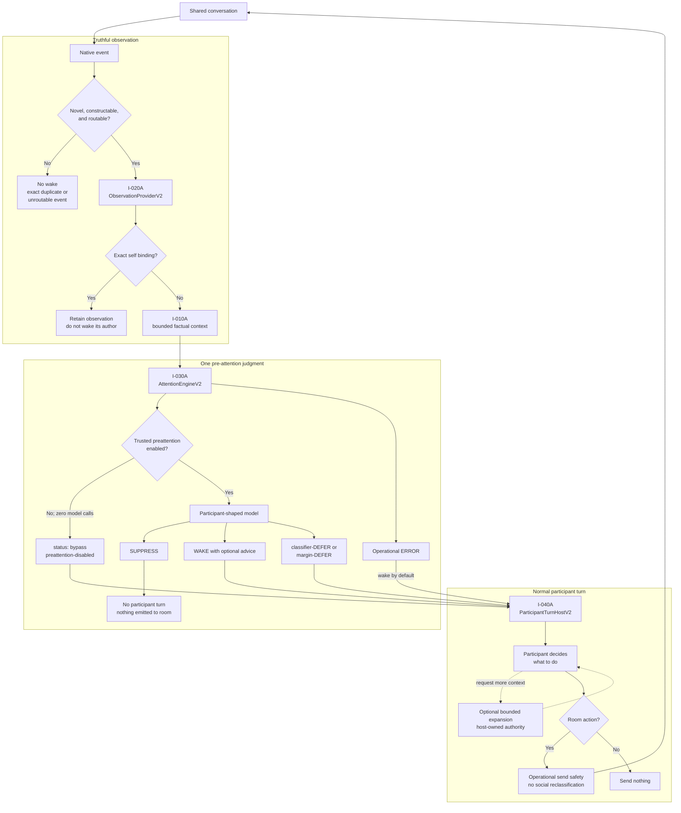
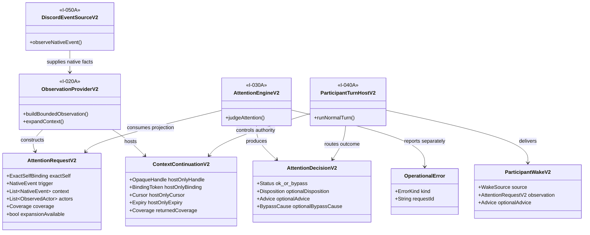
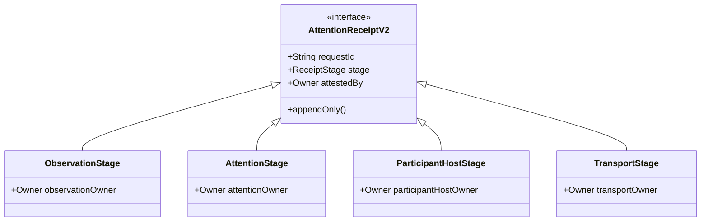
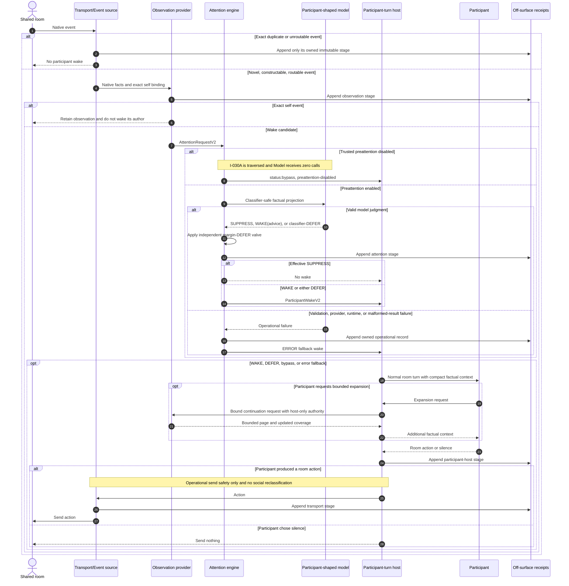
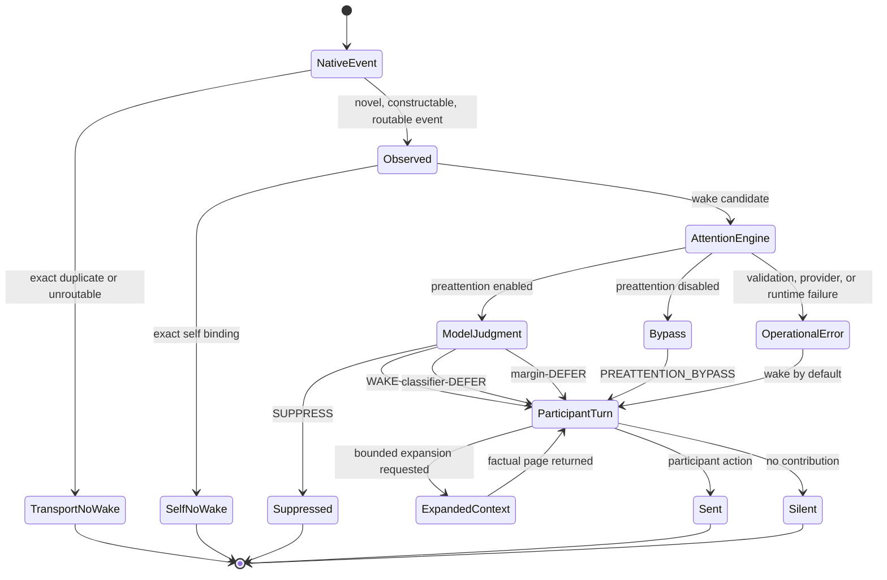
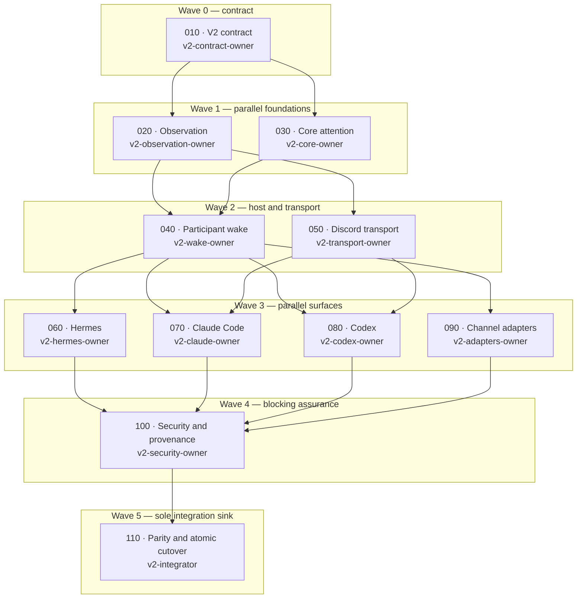

# Nunchi V2 selected-design diagrams

> **Status:** these diagrams describe the selected V2 target from Aleph Vault
> PR 67 (`bdd1ebb`), as clarified by PR 68 (`c834e8c`). The repository still
> implements V1 until the separately authorized Goal 2 performs an atomic
> cutover.

The diagrams are explanatory views of the selected design. Canonical interface
names and slice dependencies come from the V2 program; future machine-readable
contracts belong under `schemas/v2/`, not in this document.

## System boundaries

This view shows where deterministic transport handling stops, where the single
social judgment occurs, and where the participant regains control.

Only the participant-shaped model can make the social `SUPPRESS` judgment.
Deterministic handling is confined to transport-proven non-events. Trusted
bypass still traverses the engine seam but makes no classifier call and creates
no fabricated model disposition or advice.

## Canonical interface model

These UML-style class views show interface ownership and the separation between
classifier-visible facts, host-only continuation authority, and singly owned
receipt stages.

### Data and service contracts

The classifier projection contains factual coverage and whether expansion is
available. It never receives the continuation handle, binding token, cursor,
expiry, or fetch authority shown on the host side.

### Receipt-stage ownership

Each stage is immutable and request-correlated. Its named owner appends only
that stage and cannot pre-fill or mutate another owner's facts.

## End-to-end interaction

The normal path and its safety-widening alternatives share one participant
turn. Suppression is the only path that does not wake the participant.

## Lifecycle state machine

There is no state for a social handled/open ledger, an obligation queue, an
inferred roster, an admission meta-answer, or a second send-time judgment.

## V2 execution waves

This graph makes the safe parallelism visible. It shows sequencing rather than
repeating every transitive dependency; the program's dependency table remains
normative.

`020` and `030` can start together after `010`; the four surface lanes can run
in parallel after their declared foundations. `100` is a blocking audit, and
`110` alone owns cross-surface assembly and the atomic cutover.
