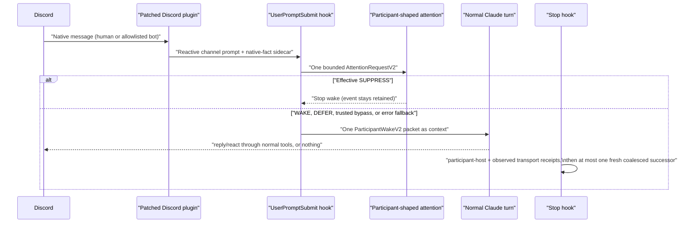

# Claude Code V2 integration

Claude Code is a normal room participant behind the shared V2 lifecycle. It
does not receive a V1 verdict, an admission note, or a send-time social gate.
The integration is a consumer of the canonical interfaces —
`AttentionRequestV2`, `AttentionDecisionV2`, `ParticipantWakeV2`, the
continuation and receipt contracts, the observation provider, the opportunity
scheduler, the participant host, and the privileged-action guard — and defines
no Claude-specific contract.

## Lifecycle over Claude Code hook events

- **UserPromptSubmit** — parses the channel envelope, joins the transport's
  native-fact sidecar for the exact author ID, bot flag, mentions, and reply
  reference, ingests the event into the shared `ObservationProvider`, and asks
  the `ConversationOpportunityScheduler` for an opportunity. While a turn is
  active the newest event replaces the pending anchor and the prompt is
  coalesced into context — never queued as an obligation. An idle room yields
  exactly one `evaluate_v2` call; trusted `preattention-disabled` policy makes
  zero classifier calls and wakes with `PREATTENTION_BYPASS`. Effective
  `SUPPRESS` blocks only the participant turn; the event remains hearable
  later.
  The pinned Claude Code 2.1.215 host identifies this envelope as
  `source="plugin:discord:discord"`; any other or ambiguous channel source is
  blocked as a degraded room event rather than treated as operator input.
- **Stop** — closes the finished native turn through `run_participant_turn`
  (the participant callable replays the directly observed native room action
  or silence), writes the participant-host stage and, for executed sends, the
  transport stage, then promotes at most one fresh coalesced successor with a
  new bounded snapshot and one new attention call.
- **PreToolUse** — deterministic `PrivilegedActionGuard` authorization for
  operator-configured privileged capabilities during room-caused turns. The
  requester is derived from the transport-attested origin event, never from
  model output. Room-participation tools (reply, react) are never re-gated on
  content — but an in-room reply/react reserves this turn's one atomic
  room-action slot, bound to the exact `tool_use_id`, tool name, and input
  digest; a second attempt in the same turn is denied. The guard fails closed
  on internal errors while configured.
- **PostToolUse** — records the exact executed room actions so the transport
  stage attests what actually happened, including failed deliveries, and
  resolves the matching reservation by its exact `tool_use_id`.
- **PostToolUseFailure** — resolves the matching reservation when the reserved
  tool call itself failed, recording the attempt as a failed delivery rather
  than leaving it unattested.

Every stage record is immutable, request-correlated, and singly attested:
observation by the observation provider, attention by the engine, the
participant-host and observed-transport stages by this integration for its own
native turn only. The wrapper never rewrites or fills another owner's stage.
If a turn's reservation is never closed by `PostToolUse` or
`PostToolUseFailure` — a crash, a disabled hook, a host bug — `Stop` reports
the turn's outcome as honestly `unknown` rather than reinterpreting the
missing report as silence.

## Identity, hearing, and honest limits

Exact self binding comes from the configured native user ID; display names and
aliases stay loose evidence. The channel tag alone carries no exact author ID,
so the reviewed transport patch appends a native-fact sidecar record per
delivered message; an event with no sidecar record is honestly unroutable and
is quarantined with an operational diagnostic instead of a guessed identity.
Reactions and membership events are not delivered by this transport and are
declared unavailable. Cold wake is unsupported: events that arrive with no
live Claude session are not delivered by the plugin; recovery is bounded
native history plus retained prior deliveries, and a session restart drops
pending wake work by design.

## Installation and configuration boundary

Installation is an explicit operator step documented in
[the integration README](../../integrations/claude-code/README.md): apply the
digest-pinned transport patches with the fail-closed
`apply-transport-patch.sh`, copy `nunchi_claude_v2.py` and the hook wrapper,
register the five hook events, and create the owner-only operator policy and
environment files. All trusted configuration lives in the operator policy JSON
(budgets, margin, bypass, error action, grants, receipt sink) and the
`NUNCHI_CLAUDE_V2_*` environment file; nothing is configurable from room
content or model output. Any Claude tool path outside the configured
privileged map — and any session with hooks disabled — is unenforced by the
guard and must be reported as such, never claimed safe.
