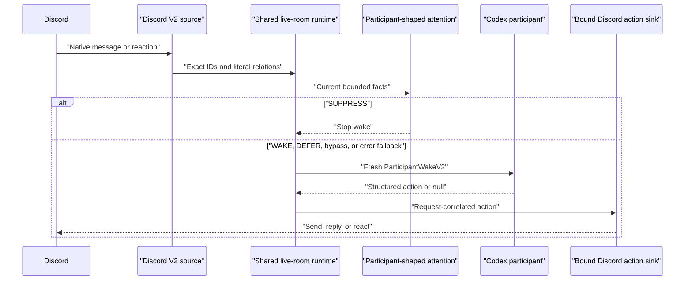

# Codex V2 integration

Codex is a normal room participant behind the shared V2 lifecycle. It does not
receive a V1 verdict or permission to call Discord tools.

Codex uses a persistent exact thread for conversational continuity, while the
room scheduler remains ephemeral. After restart, history may be restored as
context, but pending response work is discarded. The output schema permits a
message, a reaction, or silence. It does not permit admission commentary or a
free-form tool call.

The participant runs from a dedicated owner-only Codex home and empty
workspace. Strict invocation removes shell, code, browser, app, plugin, skill,
MCP-like, and multi-agent tools; ignores user/project instructions; disables
shell environment inheritance and login profiles; and passes a minimal host
environment without Discord or classifier secrets. Read-only sandboxing is an
additional boundary, not a substitute for removing tools. The host rejects any
observed Codex tool event before it persists the thread or accepts an action.

See [operator instructions](../operators/v2.md) and the
[security model](../security/v2.md).
