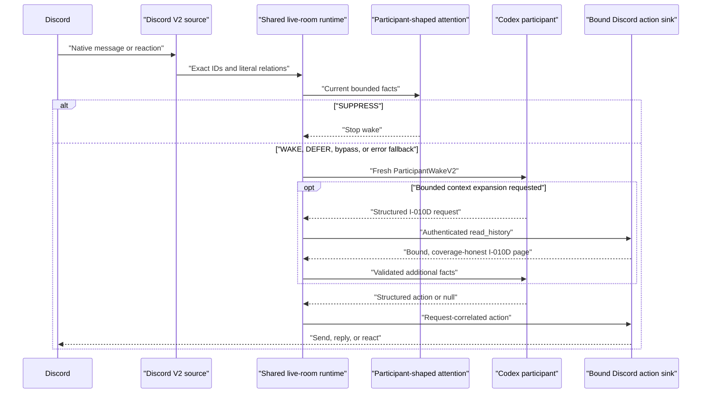

# Codex V2 integration

Codex is a normal room participant behind the shared V2 lifecycle. It does not
receive a V1 verdict or permission to call Discord tools.

Codex uses a persistent exact thread for conversational continuity, while the
room scheduler remains ephemeral. After restart, history may be restored as
context, but pending response work is discarded. The output schema permits a
message, a reaction, silence, or one bounded context-fetch request. Codex never
receives the MCP credential or a callable transport tool: the host validates
the request through `ParticipantTurn.fetch_context`, invokes authenticated
`read_history`, validates the returned page, and resumes the same Codex thread
with those facts. At most eight expansion requests fit within the original
turn and its single wall-clock deadline. The schema does not permit admission
commentary or a free-form tool call.

The participant runs from a dedicated owner-only Codex home and empty
workspace. Strict invocation removes shell, code, browser, app, plugin, skill,
MCP-like, web-search, and multi-agent tools; ignores user/project instructions;
disables shell environment inheritance and login profiles; and passes a minimal
host environment without Discord or classifier secrets. Read-only sandboxing is
an additional boundary, not a substitute for removing tools. The host rejects any
observed Codex tool event and any unknown JSONL event or item shape. It advances
the persistent thread only after the JSONL lifecycle and the bounded structured
action artifact both validate; a failed or malformed turn cannot become the
continuity base for the next room wake. The integration-private action schema
uses the strict Structured Outputs subset (nested `anyOf`, required object
fields, and nullable optional values), then normalizes those values to the
portable participant-host action contract.

The shared Discord transport requires a separate bearer credential in
`NUNCHI_MCP_DISCORD_AUTH_TOKEN` by default. `--transport-auth-env` may name a
different trusted environment variable; it never accepts the secret itself on
the command line. Every initialize, tool, and event-stream request carries that
credential. Plain HTTP is accepted only for a loopback transport, and redirects
are followed only when the scheme, host, and port remain identical. The bearer
credential must not be the Discord bot token.

The room process treats an ended notification stream as an operational failure,
not a successful one-shot completion. Run the standing process under an
operator-owned supervisor. Its restart performs a fresh authenticated MCP
handshake and bounded history backfill as context only; it never restores a
pending wake obligation or replays the old stream as FIFO work. The backfill
accepts at most the configured row limit and requires the transport's exact
closed message shape, snowflake strings, boolean bot/room-mention facts, and
native reply/mention identities. Malformed authenticated history or
inconsistent returned event/byte counts fail startup instead of being silently
omitted. Remote byte truncation and any smaller local history limit remain
visible in later attention and participant coverage as `has_more_before` plus
their distinct truncation causes. Each live
notification likewise requires the exact closed V2 envelope: version, platform,
optional string guild snowflake, string channel snowflake, and native input.
Missing, extra, or coercible envelope facts are rejected before observation or
wake scheduling. A signed continuation is retained only when its participant,
room, continuity-scope, and trigger binding exactly match that native event.

## Operator configuration surface

`nunchi-codex-config-app` is V2-only and secret-redacted. It displays the exact
participant and continuity binding, attention controls and budgets,
recoverability claim, classifier model/prompt provenance, capability grants,
session health, and bounded immutable receipts. It never returns the policy
path, receipt path, provider endpoint, API credential, Discord token, MCP
bearer, or persistent thread ID.

The app is read-only unless its local owner starts it with
`--allow-policy-write`. That flag enables an app-only tool for exactly four
non-secret attention controls and requires the exact inspected policy
provenance on every write, preventing a stale panel from overwriting a newer
operator edit. Identity, authorization, provider, budgets, receipt binding and
recoverability remain file-authority only. Persistent session removal has a
separate `--allow-session-reset` authority. Neither is inferred from a message,
reaction, model result, or room actor.

See [operator instructions](../operators/v2.md) and the
[security model](../security/v2.md).
