# Live-conversation scheduling

V2 treats each accepted live event as an observation, not as a response job.
For each exact participant and room, the shared scheduler holds at most:

- one active attention-or-participant turn; and
- one replaceable pending anchor naming the newest event observed while that
  work is active.

When the active turn finishes, the pending anchor—if any—starts one new
opportunity. The host asks the observation provider for a fresh bounded room
snapshot at that point. Events between the old and newest anchors remain
ordinary factual context in the observation provider; they do not become FIFO
work, and the scheduler does not remember an obligation to answer each one.

```mermaid
stateDiagram-v2
    [*] --> Idle
    Idle --> Active: accepted live event
    Active --> ActivePending: newer event replaces pending anchor
    ActivePending --> ActivePending: still newer event replaces pending anchor
    Active --> Idle: active work completes, no pending anchor
    ActivePending --> Active: active work completes; promote newest anchor
```

The scheduler accepts only opaque participant, platform, room, and event IDs.
It has no message-text, age, mention, reply, apparent-resolution, prior-result,
or participant-outcome input. Whether a conversational moment still deserves a
contribution remains part of the fresh participant-shaped judgment over the
current room snapshot.

Scheduler state is intentionally ephemeral. A restart creates an empty
scheduler and does not replay pending or backfilled events as wake work. The
observation provider may retain honest history and restart-gap facts as context
for the next genuinely live event.
