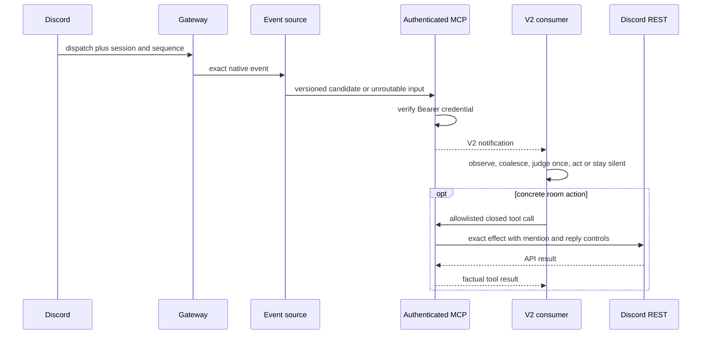

# MCP Discord V2 design

## Boundary and flow

```mermaid
flowchart LR
  D["Discord Gateway<br/>message and reaction dispatch"] --> G["Gateway protocol<br/>exact session and sequence"]
  G --> N["DiscordEventSourceV2<br/>allowlist and canonical facts"]
  N --> Q["Bounded newest-preserving<br/>notification queue"]
  Q --> A["Bearer-authenticated<br/>streamable HTTP MCP"]
  A --> C["V2 consumers<br/>observation and participants"]
  C -->|"allowlisted tool call"| T["Tool executor<br/>closed arguments and backstop"]
  T --> R["Discord REST"]
```

The gateway owns native identity and delivery facts. `DiscordEventSourceV2`
owns routing projection. MCP owns client authentication and session delivery.
The tool executor owns channel scoping and transport safety. None of these
components owns social suppression; that judgment occurs once in the portable
attention runtime after observation.

## Sequence

## Deterministic security rules

1. `NUNCHI_MCP_DISCORD_CHANNELS` is mandatory and non-empty. Every notification
   and tool path checks it; text cannot redirect a call.
2. `NUNCHI_MCP_DISCORD_AUTH_TOKEN` is mandatory, at least 32 printable ASCII
   characters, and must differ from the Discord bot token.
3. The plaintext server binds only to loopback; remote access must terminate
   TLS in a separately secured local proxy.
4. Exactly one matching HTTP Authorization header is required before MCP
   dispatch. Failure is a content-free `401`.
5. Exact self messages are retained as facts. Only the observation owner may
   classify them as the deterministic self no-wake case.
6. Message and reaction IDs come from Discord. Reactions require the gateway
   session and sequence; when either is unavailable no ID is invented.
7. A Ready-event resume URL is accepted only over `wss` on a Discord-owned
   `discord.gg` gateway host, then normalized to the fixed version and JSON
   encoding before the credential-bearing Resume payload can use it.
8. Sends use a closed allowed-mentions object, exact reply targets, Discord rate
   limits and a local per-channel backstop.
9. The live notification queue is bounded and drops oldest when full. It is not
   persisted and never becomes a FIFO of conversational obligations.
10. No V1 mode, verdict, gate hook or send-time social judgment is reachable.

## Failure semantics

| Failure | Result |
|---|---|
| Missing/wrong/duplicate bearer header | `401`; MCP handler and Discord are untouched. |
| Channel outside allowlist | Notification becomes unroutable or tool call fails; no REST effect. |
| Gateway resumable disconnect | Resume exact session/sequence with bounded backoff. |
| Non-Discord resume URL or malformed gateway identity/sequence | Refuse the resume target, discard resumable state, and reconnect for fresh identification. |
| Invalid session or fatal token/intent close | Re-identify when permitted; fatal errors terminate for supervisor visibility. |
| Queue full | Drop oldest queued notification, retain newest, log one operational warning. |
| MCP client disconnect or stalled notification write | Bound and cancel that session's write, remove only that session; other sessions and gateway continue concurrently. |
| Discord 429/5xx | Bounded rate-limit/retry policy; tool returns generic failure when exhausted. |
| Discord 401/403 | Immediate non-retryable generic tool failure. |
| SIGTERM/SIGINT | Stop notifications, drain bounded in-flight tools, close gateway, exit. |

## Dependencies and provenance

All gateway, projection, REST, authentication and tool logic is import-safe
stdlib code. Only `_binding.py` imports the optional MCP/Starlette/Uvicorn stack.
The console parser runs before that import, so a base wheel can always expose
`nunchi-mcp-discord --help`; actually serving requires the `mcp-discord` extra.
